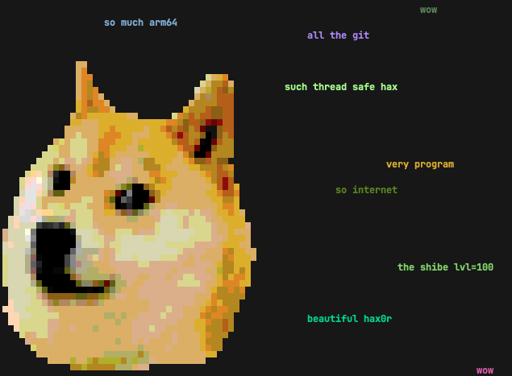

# doge

**doge** is a simple motd script based on the slightly stupid but very funny
[doge meme][doge]. It prints random grammatically incorrect statements that are
sometimes based on things from your computer.

## Features

* Randomly placed and colored random strings, complete with broken english.
* Awesome Shibe in the terminal.
* Fetching of system data, such as hostname, running processes, current user
  and `$EDITOR`.
* If you have [lolcat][], you can do this gem:
  `while true; do doge | lolcat -a -d 100 -s 100 -p 1; done`
  (thx [hom3chuk][])
* stdin support: `ls /usr/bin | doge` will doge-print some of the executables
  found in /usr/bin. wow. There are also multiple command line switches that
  control filtering and statistical frequency of words. See `doge -h`, wow.

## Installation

* `pipx install doge` (Recommended, needs [pipx][].)
* `shiv doge -c doge -o doge.pyz`
* `pex doge -c doge -o doge.pyz`
* Install with *pip*, see
  [A quick-and-dirty guide on how to install packages for Python][install_guide]
  for more information.
  * `python3 -m pip install doge`

If you don't want to do that for whatever reason, there is a proper
`pyproject.toml` included, so `python -m pip install -e .` should be just fine for that.

Then, just add a call to `doge` at the bottom of your shell rc file.

## Notes

You need a terminal that supports 256 colors running on a system that supports
unicode.

The terminal Shibe was created with hax0r Gimp skills and [img2xterm][i2x].

[doge]: http://knowyourmeme.com/memes/doge
[i2x]: https://github.com/rossy2401/img2xterm
[hom3chuk]: https://github.com/hom3chuk
[lolcat]: https://github.com/busyloop/lolcat
[pipx]: https://pipx.pypa.io
[install_guide]: https://snarky.ca/a-quick-and-dirty-guide-on-how-to-install-packages-for-python/
